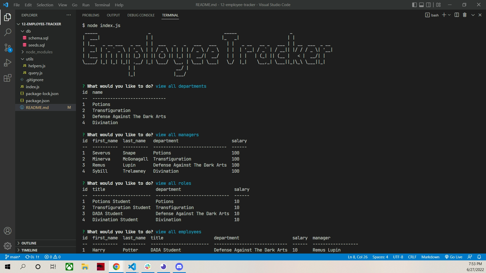

# Employee Tracker

## Table of Contents
1. [Description](#description)
2. [Usage](#usage)
3. [Installation](#installation)
4. [Visuals](#visuals)
5. [Resources](#resources)

## Description

A node.js program that uses inquirer and mysql2 to track and update a database.

Features include:

- Ability to view all departments, rolls, managers, employees, employees by manager, employees by department, and department budgets.
- Ability to add departments, rolls, managers, and employees.
- Ability to update managers, rolls, and employees.
- Ability to delete departments, managers, rolls, and employees.
- Formatted tables display data.

## Usage

When starting the node index.js process, the user is prompted to choose a selection. Follow through the prompts to select, update, and delete data from the database. If user wants to start over, reinstall the program following the installation instructions.

## Installation

After cloning the repo, run npm install, then run mysql -u root to access the mysql shell. From there, run source db/schema.sql; followed by source db/seeds.sql;. This will create and seed the database. From there, exit the shell and run node index.js from the command line. Follow the prompts to affect the database.

## Visuals

An example of the Tracker running.

## Resources
- [Walkthrough Video](https://drive.google.com/file/d/1EnTavy77JiLVqjEp2L8-BcIJaMwuExiA/view)
- [Repository](https://github.com/kleylakb89/12-employee-tracker)